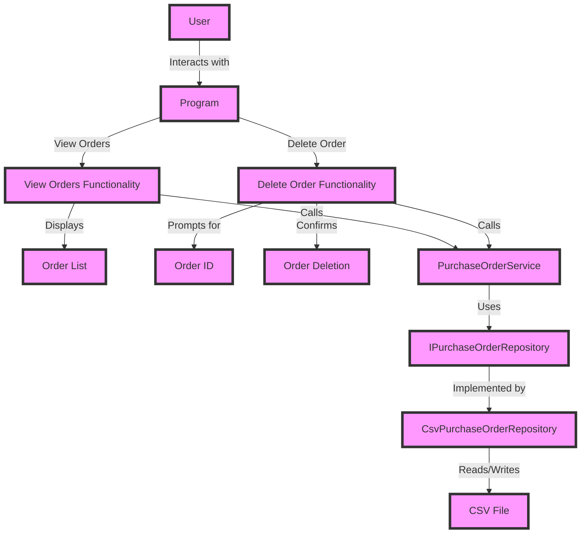

# Learning
This is for learning purpose

# PurchaseOrderDemo Diagram

## Functionalities and Backend Components

```mermaid

graph TD
    A[User] -->|Interacts with| B[Program]
    B[Program] -->|View Orders| C[View Orders Functionality]
    B[Program] -->|Delete Order| D[Delete Order Functionality]

    C[View Orders Functionality] -->|Displays| E[Order List]
    D[Delete Order Functionality] -->|Prompts for| F[Order ID]
    D[Delete Order Functionality] -->|Confirms| G[Order Deletion]

    C[View Orders Functionality] -->|Calls| H[PurchaseOrderService]
    D[Delete Order Functionality] -->|Calls| H[PurchaseOrderService]

    H[PurchaseOrderService] -->|Uses| I[IPurchaseOrderRepository]
    I[IPurchaseOrderRepository] -->|Implemented by| J[CsvPurchaseOrderRepository]
    J[CsvPurchaseOrderRepository] -->|Reads/Writes| K[CSV File]

    classDef classA fill:#f9f,stroke:#333,stroke-width:4px;
    class A,B,C,D,E,F,G,H,I,J,K classA;


```
